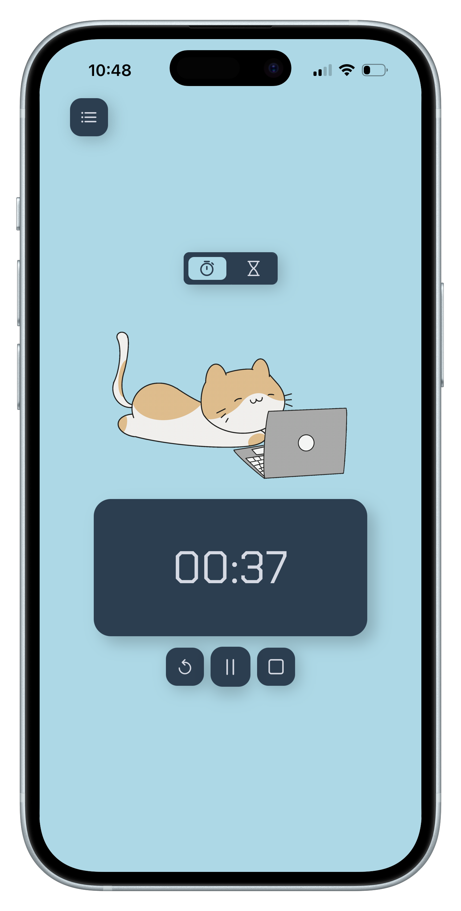
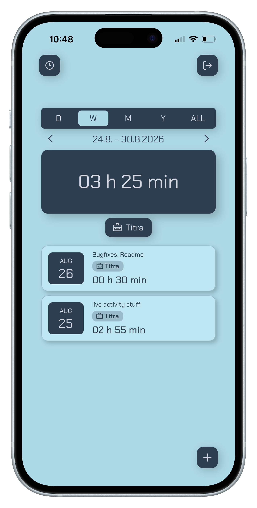
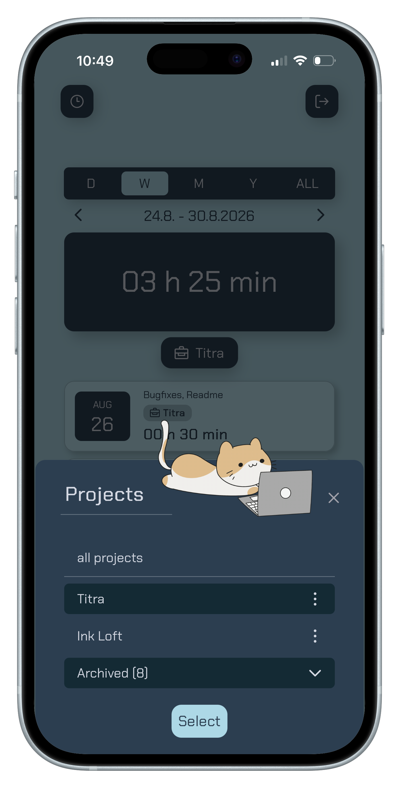
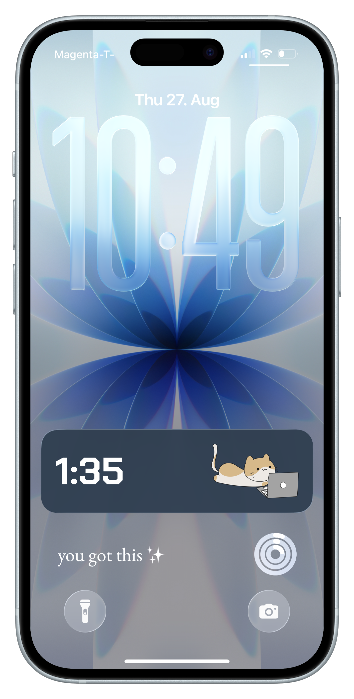

# titra 🐈

**titra** means **time tracker** ⏱️. It is a friendly stopwatch and countdown app for recording work sessions, organizing them by project, and keeping the current timer visible through iOS Live Activities.

## Screenshots 📸

<p align="center">
  
  
  
  
</p>

## Features 🪄

- Count-up stopwatch and configurable countdown timer
- Pause, resume, reset, and save timer sessions
- Optional project and description for each saved session
- Session history with project filtering and summaries
- Project creation, renaming, archiving, and deletion
- Installable progressive web app (PWA)
- Native iOS app with Lock Screen and Dynamic Island Live Activities

## Tech stack ⚒️

- Vue 3, Vite, PrimeVue, and Capacitor
- Ruby on Rails JSON API
- PostgreSQL
- ActivityKit and WidgetKit for iOS Live Activities
- A local Capacitor plugin in `frontend/live-activities`

## Quick tutorial 💻

1. Register a new account, or log in with an existing account.
2. Choose the **stopwatch** to count up, or the **hourglass** to count down. For a countdown, enter its duration in minutes.
3. Press **play** to begin. Use **pause** to keep the elapsed time without saving, or **reset** to discard the current timer.
4. Press **stop** to finish and save the session.
5. In the “Great job!” panel, optionally choose or enter a project and add a description. A new project is created automatically when its name does not exist yet.
6. Open the session list with the list button in the top-left corner. There you can review, filter, edit, or manually add sessions and manage projects.

## Use iOS Live Activities ✨

The native iOS app starts a Live Activity whenever a timer starts. The timer remains visible on the Lock Screen and, on supported iPhones, in the Dynamic Island.

### Build and install the iOS app 📱

You need macOS, Xcode, CocoaPods, and an iPhone or simulator that supports Live Activities. The checked-in Xcode project currently has an iOS 18.6 deployment target.

```bash
cd frontend
npm install
npm run build
npx cap sync ios
npx cap open ios
```

In Xcode:

1. Select your development team for both the **App** and **livetimerExtension** targets.
2. If required for your Apple developer account, replace the existing app and extension bundle identifiers and update the shared App Group in both entitlements files.
3. Select the **App** scheme and an iPhone or simulator, then run the project.

The native build uses `https://titra.d4xika.com/api/` by default. To use another backend, set `VITE_API_URL` before building; the URL must include the trailing `/api/` path and be reachable from the device:

```bash
VITE_API_URL=https://your-server.example/api/ npm run build
npx cap sync ios
```

### Try the Live Activity ⏱️

1. Open titra on iOS and log in.
2. Start the stopwatch or a countdown. The Live Activity appears on the Lock Screen and in the Dynamic Island where available.
3. Lock the phone or leave the app; the displayed timer continues updating.
4. Return to titra and press **pause**, **reset**, or **stop** to end the Live Activity. Pressing **stop** also saves the session.

If no Live Activity appears, confirm that Live Activities are enabled for titra in iOS Settings and that both Xcode targets are correctly signed.

## Project structure 🏛️

```text
backend/                    Rails API and PostgreSQL models
frontend/                   Vue web app and Capacitor shell
frontend/ios/               Native iOS app and Live Activity extension
frontend/live-activities/   Local Capacitor bridge for ActivityKit
```
